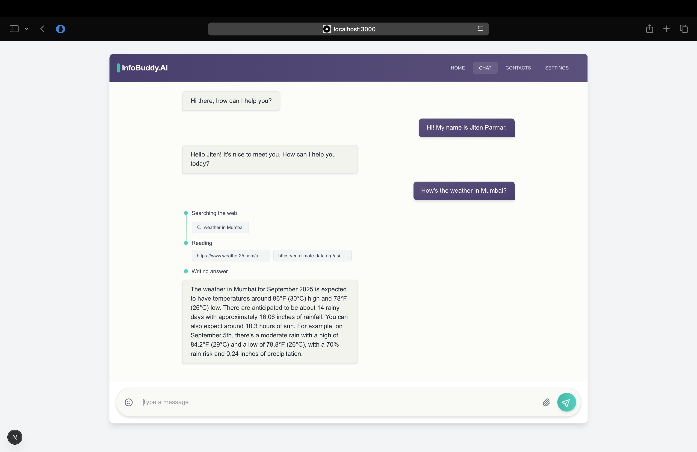

# InfoBuddy.AI 🤖✨

InfoBuddy.AI is a full-stack, production-ready conversational AI application featuring a real-time streaming interface and web search capabilities, powered by LangGraph and Google's Gemini model.



---

## 🌟 Features

### Client-Side (Next.js)

- **Real-time Streaming:** Messages stream in token-by-token for a responsive, interactive experience.
- **Persistent Conversations:** Chat history is maintained across sessions using a `conversation_id`.
- **Search Visualization:** The UI displays the agent's thought process, including search queries and results.
- **Markdown Support:** Renders formatted responses, including code blocks, lists, and links.
- **Responsive Design:** A clean, modern UI that works seamlessly on desktop and mobile.
- **Health Check:** Automatically checks server status on load.

### Server-Side (FastAPI)

- **Advanced Agent Logic:** Uses **LangGraph** to orchestrate complex workflows between the LLM and tools.
- **Tool Integration:** Equipped with **Tavily Search** to answer questions about recent events.
- **Conversation Memory:** Remembers previous parts of the conversation for contextual responses.
- **High-Performance Backend:** Built with **FastAPI** and `asyncio` for non-blocking, concurrent request handling.
- **Production-Ready:** Includes rate limiting, graceful shutdowns, CORS, and a health check endpoint.
- **Streaming API:** Uses Server-Sent Events (SSE) for efficient, unidirectional data flow to the client.

---

## 🛠️ Tech Stack

| Category       | Technology                                  |
| -------------- | ------------------------------------------- |
| **Frontend**   | Next.js, React, TypeScript, Tailwind CSS    |
| **Backend**    | Python, FastAPI, LangChain, Uvicorn         |
| **AI / LLM**   | Google Gemini, LangGraph, Tavily Search API |
| **Deployment** | Docker (optional), Gunicorn                 |

---

## 📂 Project Structure

The project is organized into two main directories:

```
InfoBuddy.AI/
├── client/         # Next.js frontend application
│   ├── src/
│   └── ...
└── server/         # FastAPI backend application
    ├── app.py
    └── ...
```

---

## 🚀 Getting Started

Follow these steps to set up and run the project locally.

### Prerequisites

- **Node.js** (v18.x or later)
- **Python** (v3.10 or later)
- **API Keys** for:
  - Google (for Gemini)
  - Tavily AI

### 1. Create a virtual environment

```bash
uv venv
source venv/bin/activate
uv pip install -r requirements.txt
```

### 2. Backend Setup (Server)

First, set up and run the FastAPI server.

```bash
# 1. Navigate to the server directory
cd server

# 2. Set up environment variables
# refer .env.example and enter your api keys

# 3. Run the server
# For development with auto-reload:
uvicorn app:app --host 0.0.0.0 --port 8000 --reload
```

The server will be running at `http://localhost:8000`.

### 3. Frontend Setup (Client)

Next, set up and run the Next.js client in a separate terminal.

```bash
# 1. Navigate to the client directory
cd client

# 2. Install Node.js dependencies
npm install

# 3. Set up environment variables
# refer .env.example and enter your api keys

# 4. Run the client
npm run dev
```

The client will be running at `http://localhost:3000`. Open this URL in your browser to start chatting!

---

## 🔑 Environment Variables

### Server (`server/.env`)

```
# API Keys for AI services
GOOGLE_API_KEY="your_google_api_key"
TAVILY_API_KEY="your_tavily_api_key"
```

### Client (`client/.env.local`)

```
# URL of the backend server
NEXT_PUBLIC_SERVER_URL="http://localhost:8000"
```

---

## 🌐 API Endpoints

The server exposes the following endpoints:

- **`GET /health`**

  - Checks the health of the server and its components.
  - **Response:**
    ```json
    {
      "status": "healthy",
      "service": "InfoBuddy.AI Server",
      "model": "gemini-2.5-flash",
      "components": { "llm": "ok", "search_tool": "ok", ... }
    }
    ```

- **`GET /chat_stream/{message}`**
  - The main endpoint for sending a message and receiving a streamed response.
  - **Query Parameters:**
    - `conversation_id` (optional): The ID of an ongoing conversation.
  - **Response:** A stream of Server-Sent Events (`text/event-stream`).

---

## 🤝 Contributing

Contributions are welcome! Please feel free to submit a pull request or open an issue for bugs, feature requests, or improvements.

1.  **Fork** the repository.
2.  Create a new branch (`git checkout -b feature/YourFeature`).
3.  Make your changes.
4.  **Commit** your changes (`git commit -m 'Add some feature'`).
5.  **Push** to the branch (`git push origin feature/YourFeature`).
6.  Open a **Pull Request**.

---

## ~ Made with ❤️ by Jiten!
